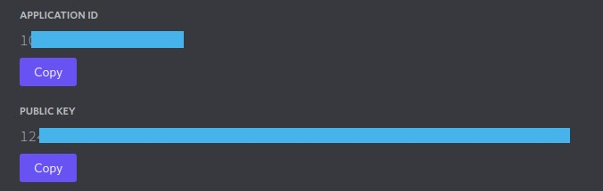
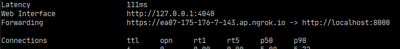
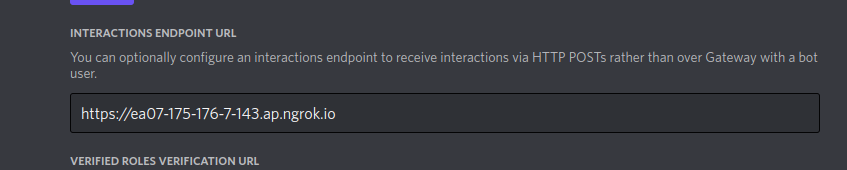

# disinter.py

A discord interactions library to receieve interactions via HTTP Posts with an API endpoint.

## Usage

(Still trying to update...)

Check out some of the [examples...](../examples/)

- Required environment variables or presets



```python
import os

TOKEN = os.environ.get("TOKEN", "") # your bot token
APPLICATION_ID = os.environ.get("APPLICATION_ID", "") # application id of the bot app
GUILDS = os.environ.get("GUILD", "").split(",") # guilds you want the bot to register to,\
                                                # if None it will register as global command
PUBLIC_KEY = os.environ.get("PUBLIC_KEY", "") # the bot's public key
```

- Create and manage the bot in a `main.py` or so...

```python
# main.py
import os

from disinter import DisInter
from disinter.context import SlashContext

TOKEN = os.environ.get("TOKEN", "")
APPLICATION_ID = os.environ.get("APPLICATION_ID", "")
GUILDS = os.environ.get("GUILD", "").split(",")
PUBLIC_KEY = os.environ.get("PUBLIC_KEY", "")

bot = DisInter(
    token=TOKEN, application_id=APPLICATION_ID, public_key=PUBLIC_KEY, guilds=GUILDS
)


@bot.on_event("startup")
def start():
    try:
        # register the commands
        bot.sync_commands()
    except Exception as e:
        print(e)


@bot.slash_command(name="ping", description="Ping command")
async def ping(ctx: SlashContext):
    return ctx.reply("pong")

```

- Run the server. `disinter.py` wraps over `FastAPI` so you can run it asgi server like `uvicorn`

```sh
uvicorn main:bot --reload
```

### Development

If you have your app running with `uvicorn`, you can use `ngrok` (install it first) to reverse proxy and use it to test your bot.

```sh
ngrok http 8000 # replace with the port your asgi server is running in
```

- Copy your forwarding url

  

- Update your `Interactions Endpoint Url` in your discord app dashboard

  

You can now enjoy developing your bot :tada: !

## Not implemented features

- File attachments
- Autocomplete
- ~~Modals~~
- Deferred response
- etc...

##

**&copy; 2022 | TheBoringDude**
